# Rastreabilidade Projeto Tecsus

Este repositorio documenta a estrategia de rastreabilidade utilizada no projeto Tecsus.

A rastreabilidade permite acompanhar a evolucao de uma necessidade desde a solicitacao inicial ate a entrega final, conectando requisitos, user stories, issues do Jira, branches, commits, merge requests, pipelines e releases.

## Mini Apresentacao

### 1. Objetivo

O objetivo da rastreabilidade e garantir que cada funcionalidade entregue consiga ser ligada aos artefatos que justificam sua existencia.

Com isso, conseguimos responder:

- Qual requisito originou uma task?
- Quais tasks implementam um requisito?
- Qual branch ou commit implementou uma issue?
- Em qual release a funcionalidade foi entregue?
- Quais entregaveis comprovam o desenvolvimento?

### 2. Fluxo Geral

```mermaid
flowchart LR
    Request["Request<br/>Solicitacao inicial"] --> Req["Requisito<br/>RF / RNF"]
    Req --> US["User Story<br/>US-XX"]
    US --> Jira["Issue Jira<br/>SCRUM-XX"]
    Jira --> Branch["Branch GitLab"]
    Branch --> Commit["Commit"]
    Commit --> MR["Merge Request"]
    MR --> Pipeline["Pipeline CI"]
    Pipeline --> Review["Code Review"]
    Review --> Develop["Merge na develop"]
    Develop --> Main["Merge na main"]
    Main --> Deploy["Deploy / Release"]
```



### 3. Como Demonstrar

1. Abrir a documentacao de rastreabilidade.
2. Mostrar a convencao de IDs, por exemplo `RF-04`, `US-19`, `SCRUM-88` e `REL-03`.
3. Abrir o Jira e pesquisar por um requisito funcional.
4. Mostrar as issues vinculadas ao requisito.
5. Abrir o GitLab e mostrar branch, commit ou merge request com o ID da issue.
6. Concluir mostrando em qual release a entrega entrou.

Exemplo de busca no Jira:

```jql
project = SCRUM AND labels = "RF-04" ORDER BY key ASC
```

Exemplo de busca por mais de um requisito:

```jql
project = SCRUM AND labels in ("RF-02", "RF-04") ORDER BY key ASC
```

## Convencao de Identificadores

Os IDs padronizam os artefatos do projeto e facilitam a busca entre ferramentas.

| Prefixo | Tipo | Descricao |
|---|---|---|
| `REQ` | Requisito | Solicitacao inicial |
| `RF` | Requisito funcional | Funcionalidade do sistema |
| `RNF` | Requisito nao funcional | Caracteristica tecnica do sistema |
| `US` | User Story | Necessidade descrita pela perspectiva do usuario |
| `ISSUE` | Issue | Tarefa criada no Jira |
| `BR` | Branch | Branch de desenvolvimento |
| `MR` | Merge Request | Solicitacao de merge |
| `TC` | Test Case | Caso de teste |
| `REL` | Release | Versao do sistema |

Formato geral:

```text
PREFIXO-NUMERO
```

Exemplos:

```text
RF-04
US-19
SCRUM-88
REL-03
```

## Requisitos Funcionais

| ID | Descricao |
|---|---|
| `RF-01` | Modelo de dados dinamico para receber e registrar estacoes meteorologicas com diferentes sensores. |
| `RF-02` | CRUD completo para Estacoes, Parametros, Alertas e Usuarios. |
| `RF-03` | Recepcao e armazenamento continuo de dados enviados via MQTT com servico em Node.js. |
| `RF-04` | Dashboards, visualizacao interativa de parametros climaticos e geracao de relatorios estatisticos. |
| `RF-05` | Geracao automatica de alertas com base em condicoes meteorologicas especificas. |
| `RF-06` | Datalogger, hardware e estacao meteorologica fisica. |
| `RF-07` | Tutorial educativo integrado ao sistema sobre os parametros medidos. |
| `RF-08` | Controle de acesso com pelo menos dois niveis: administrador e publico. |

## Requisitos Nao Funcionais

| ID | Descricao |
|---|---|
| `RNF-01` | Experiencia do usuario nos dashboards em React, priorizando usabilidade e estetica. |
| `RNF-02` | Documentacao detalhada das APIs, incluindo exemplos de uso. |
| `RNF-03` | Integracao continua com pipelines automatizadas no GitLab. |
| `RNF-04` | Deploy automatizado com Docker em nuvem, respeitando restricoes de orcamento. |
| `RNF-05` | API capaz de suportar multiplas conexoes assincronas simultaneas de dispositivos IoT. |

## User Stories

As user stories descrevem necessidades do usuario no formato:

```text
Como [tipo de usuario], quero [acao], para [objetivo].
```

Exemplos usados na rastreabilidade:

| ID | Prioridade | User Story | Sprint |
|---|---|---|---|
| `US-10` | Alta | Acessar explicativo com o significado de cada parametro medido. | 3 |
| `US-17` | Media | Cadastrar administradores com diferentes niveis de moderacao. | 3 |
| `US-18` | Media | Receber notificacoes sobre alertas. | 3 |
| `US-19` | Baixa | Aplicar filtros e pesquisa detalhada de estacoes. | 3 |
| `US-20` | Baixa | Cadastrar parametros com valor, offset e nome. | 3 |

## Sprint Backlog

As issues do Jira representam as tarefas tecnicas necessarias para implementar as user stories.

Exemplos da Sprint 3:

| Issue | Descricao | Sprint |
|---|---|---|
| `SCRUM-69` | Acessar explicativo com o significado de cada parametro medido. | 3 |
| `SCRUM-71` | Escrever a definicao de cada parametro utilizado no backend. | 3 |
| `SCRUM-86` | Cadastrar outros administradores com diferentes niveis de moderacao. | 3 |
| `SCRUM-87` | Enviar notificacoes sobre alertas. | 3 |
| `SCRUM-88` | Aplicacao de filtros e pesquisa detalhada. | 3 |
| `SCRUM-89` | Cadastrar parametros com valor, offset e nome. | 3 |
| `SCRUM-114` | Alterar logica backend para geracao de alertas. | 3 |

## Convencao de Commits

O projeto utiliza uma adaptacao de Conventional Commits para ligar alteracoes de codigo as issues do Jira.

Estrutura:

```text
tipo[ID-task]: descricao da alteracao
```

Exemplo:

```text
feat[SCRUM-04]: implementacao do dashboard meteorologico
```

Prefixos utilizados:

| Prefixo | Significado |
|---|---|
| `feat` | Nova funcionalidade |
| `fix` | Correcao de bug |
| `refactor` | Melhoria de codigo |
| `docs` | Alteracao em documentacao |
| `style` | Alteracao de estilo |

## Padrao No GitLab

Para fortalecer a rastreabilidade, branches, commits e merge requests devem conter o ID da issue e, quando possivel, o ID do requisito.

Exemplo:

```text
Branch: feat/SCRUM-88-RF-04-filtros
Commit: feat[SCRUM-88]: implementa filtros da pesquisa detalhada
Merge Request: SCRUM-88 RF-04 - Aplicacao de filtros e pesquisa detalhada
```

Esse padrao permite procurar por `SCRUM-88` ou `RF-04` no GitLab e encontrar a entrega relacionada.

## Matriz De Rastreabilidade

A matriz conecta requisito, user story, issue, branch, commit e release.

### Sprint 1 - Concluida

| Requisito | User Story | Issue | Branch | Commit | Release |
|---|---|---|---|---|---|
| `RF-01` | `US-03` | `SCRUM-45` | `feat/SCRUM-48-49` | `feat[SCRUM-48-49]` | `REL-01` |
| `RF-02` | `US-01` | `SCRUM-40` | `feat/SCRUM-35-36` | `feat[SCRUM-35]` | `REL-01` |
| `RF-03` | `US-04` | `SCRUM-48` | `feat/SCRUM-48-49` | `feat[SCRUM-48-49]` | `REL-01` |
| `RF-05` | `US-07` | `SCRUM-56` | `feat/SCRUM-56-60` | `feat[SCRUM-56-60]` | `REL-01` |
| `RF-06` | `US-06` | `SCRUM-50` | `feat/SCRUM-50` | `feat[SCRUM-50]` | `REL-01` |
| `RF-08` | `US-08` | `SCRUM-63` | `feat/SCRUM-63` | `feat[SCRUM-63]` | `REL-01` |

### Sprint 2 - Concluida

| Requisito | User Story | Issue | Branch | Commit | Release |
|---|---|---|---|---|---|
| `RF-04` | `US-12` | `SCRUM-72` | `feat/SCRUM-72` | `feat[SCRUM-72]` | `REL-02` |
| `RF-04` | `US-12` | `SCRUM-73` | `feat/SCRUM-73-74` | `feat[SCRUM-73]` | `REL-02` |
| `RF-04` | `US-13` | `SCRUM-75` | `feat/SCRUM-75-77` | `feat[SCRUM-75-77]` | `REL-02` |
| `RF-04` | `US-14` | `SCRUM-79` | `feat/SCRUM-79-81` | `feat[SCRUM-79-81]` | `REL-02` |
| `RF-04` | `US-15` | `SCRUM-83` | `feat/SCRUM-83-84` | `feat[SCRUM-83]` | `REL-02` |

### Sprint 3 - Concluida

| Requisito | User Story | Issue | Branch | Commit | Release |
|---|---|---|---|---|---|
| `RF-01` | `US-20` | `SCRUM-89` | `feat-SCRUM-86` | `feat[SCRUM-86]` | `REL-03` |
| `RF-04` | `US-19` | `SCRUM-88` | `feat-SCRUM-88` | `feat[SCRUM-88]` | `REL-03` |
| `RF-05` | `US-18` | `SCRUM-87` | `feat/SCRUM-114` | `feat[SCRUM-114]` | `REL-03` |
| `RF-07` | `US-10` | `SCRUM-86` | `feat-SCRUM-86` | `feat[SCRUM-86]` | `REL-03` |
| `RF-08` | `US-17` | `SCRUM-69` | `feat/SCRUM-71` | `feat[SCRUM-71]` | `REL-03` |

> Observacao: linhas marcadas como `[PREENCHER]` na documentacao original indicam dados que ainda precisam ser completados com informacoes do GitLab.

## Releases

| Release | Requisitos incluidos | Data |
|---|---|---|
| `REL-01` | `RF-01`, `RF-02`, `RF-03`, `RF-05`, `RF-06`, `RF-08` | 05/04 |
| `REL-02` | `RF-02`, `RF-04` | 03/05 |
| `REL-03` | `RF-01`, `RF-04`, `RF-05`, `RF-07`, `RF-08` | 31/05 |

## Como Consultar Por Requisito

No Jira, os requisitos podem ser consultados por categoria/label.

Exemplo para o `RF-04`:

```jql
project = SCRUM AND labels = "RF-04" ORDER BY key ASC
```

No GitLab, a consulta deve ser feita pelo mesmo identificador, procurando por:

```text
RF-04
SCRUM-88
feat[SCRUM-88]
```

Assim, o requisito pode ser rastreado da documentacao ate a entrega de codigo.

## Roteiro Curto De Fala

> A rastreabilidade do projeto Tecsus conecta requisitos funcionais, user stories, issues do Jira, implementacoes no GitLab e releases.

> Para isso, usamos IDs padronizados, como `RF-04` para requisitos funcionais, `US-19` para user stories, `SCRUM-88` para issues e `REL-03` para releases.

> No Jira, as issues sao categorizadas com o requisito correspondente. Dessa forma, consigo pesquisar por `RF-04` e visualizar todas as tasks ligadas a esse requisito.

> No GitLab, a ligacao aparece nas branches, commits e merge requests. Assim, o mesmo identificador usado no Jira tambem permite encontrar a implementacao.

> O resultado final e uma matriz de rastreabilidade que mostra o caminho completo: requisito, user story, issue, branch, commit e release.

## Link Da Documentacao

Documento original:

https://docs.google.com/document/d/1aa44y00OZagi_VY_9IpeEBvQnP9NymxPqWymP8JeEwA/edit?tab=t.0
