# Rastreabilidade Projeto Tecsus

Este repositorio documenta a estrategia de rastreabilidade utilizada no projeto Tecsus.

A rastreabilidade permite acompanhar a evolucao de uma necessidade desde a solicitacao inicial ate a entrega final, conectando requisitos, user stories, issues do Jira, branches, commits, merge requests, pipelines e releases.

### 1. Objetivo

O objetivo da rastreabilidade e garantir que cada funcionalidade entregue consiga ser ligada aos artefatos que justificam sua existencia.

Com isso, conseguimos responder:

- Qual requisito originou uma task?
- Quais tasks implementam um requisito?
- Qual branch ou commit implementou uma issue?
- Em qual release a funcionalidade foi entregue?
- Quais entregaveis comprovam o desenvolvimento?

### 2. Fluxo Geral

```mermaid
flowchart LR
    Request["Request<br/>Solicitacao inicial"] --> Req["Requisito<br/>RF / RNF"]
    Req --> US["User Story<br/>US-XX"]
    US --> Jira["Issue Jira<br/>SCRUM-XX"]
    Jira --> Branch["Branch GitLab"]
    Branch --> Commit["Commit"]
    Commit --> MR["Merge Request"]
    MR --> Pipeline["Pipeline CI"]
    Pipeline --> Review["Code Review"]
    Review --> Develop["Merge na develop"]
    Develop --> Main["Merge na main"]
    Main --> Deploy["Deploy / Release"]
```



### 3. Como Demonstrar

1. Abrir a documentacao de rastreabilidade.
2. Mostrar a convencao de IDs, por exemplo `RF-04`, `US-19`, `SCRUM-88` e `REL-03`.
3. Abrir o Jira e pesquisar por um requisito funcional.
4. Mostrar as issues vinculadas ao requisito.
5. Abrir o GitLab e mostrar branch, commit ou merge request com o ID da issue.
6. Concluir mostrando em qual release a entrega entrou.

Exemplo de busca no Jira:

```jql
project = SCRUM AND labels = "RF-04" ORDER BY key ASC
```

Exemplo de busca por mais de um requisito:

```jql
project = SCRUM AND labels in ("RF-02", "RF-04") ORDER BY key ASC
```

## Convencao de Identificadores

Os IDs padronizam os artefatos do projeto e facilitam a busca entre ferramentas.

| Prefixo | Tipo | Descricao |
|---|---|---|
| `REQ` | Requisito | Solicitacao inicial |
| `RF` | Requisito funcional | Funcionalidade do sistema |
| `RNF` | Requisito nao funcional | Caracteristica tecnica do sistema |
| `US` | User Story | Necessidade descrita pela perspectiva do usuario |
| `ISSUE` | Issue | Tarefa criada no Jira |
| `BR` | Branch | Branch de desenvolvimento |
| `MR` | Merge Request | Solicitacao de merge |
| `TC` | Test Case | Caso de teste |
| `REL` | Release | Versao do sistema |

Formato geral:

```text
PREFIXO-NUMERO
```

Exemplos:

```text
RF-04
US-19
SCRUM-88
REL-03
```

## Requisitos Funcionais

| ID | Descricao |
|---|---|
| `RF-01` | Modelo de dados dinamico para receber e registrar estacoes meteorologicas com diferentes sensores. |
| `RF-02` | CRUD completo para Estacoes, Parametros, Alertas e Usuarios. |
| `RF-03` | Recepcao e armazenamento continuo de dados enviados via MQTT com servico em Node.js. |
| `RF-04` | Dashboards, visualizacao interativa de parametros climaticos e geracao de relatorios estatisticos. |
| `RF-05` | Geracao automatica de alertas com base em condicoes meteorologicas especificas. |
| `RF-06` | Datalogger, hardware e estacao meteorologica fisica. |
| `RF-07` | Tutorial educativo integrado ao sistema sobre os parametros medidos. |
| `RF-08` | Controle de acesso com pelo menos dois niveis: administrador e publico. |

## Requisitos Nao Funcionais

| ID | Descricao |
|---|---|
| `RNF-01` | Experiencia do usuario nos dashboards em React, priorizando usabilidade e estetica. |
| `RNF-02` | Documentacao detalhada das APIs, incluindo exemplos de uso. |
| `RNF-03` | Integracao continua com pipelines automatizadas no GitLab. |
| `RNF-04` | Deploy automatizado com Docker em nuvem, respeitando restricoes de orcamento. |
| `RNF-05` | API capaz de suportar multiplas conexoes assincronas simultaneas de dispositivos IoT. |

## User Stories

As user stories descrevem necessidades do usuario no formato:

```text
Como [tipo de usuario], quero [acao], para [objetivo].
```

Exemplos usados na rastreabilidade:

| ID | Prioridade | User Story | Sprint |
|---|---|---|---|
| `US-10` | Alta | Acessar explicativo com o significado de cada parametro medido. | 3 |
| `US-17` | Media | Cadastrar administradores com diferentes niveis de moderacao. | 3 |
| `US-18` | Media | Receber notificacoes sobre alertas. | 3 |
| `US-19` | Baixa | Aplicar filtros e pesquisa detalhada de estacoes. | 3 |
| `US-20` | Baixa | Cadastrar parametros com valor, offset e nome. | 3 |
| `US-21` | Media | Exibir a listagem de estacoes de forma paginada para melhorar o desempenho da interface. | 4 |
| `US-22` | Media | Registrar acoes criticas em logs de auditoria para manter historico e seguranca. | 4 |
| `US-23` | Media | Visualizar um resumo da saude das estacoes e dos alertas emitidos no dia. | 4 |
| `US-24` | Media | Validar email e senha no cadastro e login para aumentar a seguranca das contas. | 4 |
| `US-25` | Media | Permitir redefinicao de senha para recuperacao autonoma e segura do acesso. | 4 |

## Sprint Backlog

As issues do Jira representam as tarefas tecnicas necessarias para implementar as user stories.

Exemplos da Sprint 3:

| Issue | Descricao | Sprint |
|---|---|---|
| `SCRUM-69` | Acessar explicativo com o significado de cada parametro medido. | 3 |
| `SCRUM-71` | Escrever a definicao de cada parametro utilizado no backend. | 3 |
| `SCRUM-86` | Cadastrar outros administradores com diferentes niveis de moderacao. | 3 |
| `SCRUM-87` | Enviar notificacoes sobre alertas. | 3 |
| `SCRUM-88` | Aplicacao de filtros e pesquisa detalhada. | 3 |
| `SCRUM-89` | Cadastrar parametros com valor, offset e nome. | 3 |
| `SCRUM-114` | Alterar logica backend para geracao de alertas. | 3 |

Exemplos da Sprint 4:

| Issue | Descricao | Sprint |
|---|---|---|
| `SCRUM-137` | Listagem paginada das estacoes. | 4 |
| `SCRUM-138` | Registro automatico de logs de auditoria para acoes criticas. | 4 |
| `SCRUM-139` | Desenvolver logica backend para paginacao de estacoes. | 4 |
| `SCRUM-140` | Implementar logica frontend para buscar estacoes com limitacao. | 4 |
| `SCRUM-141` | Criar componentes responsaveis pela paginacao. | 4 |
| `SCRUM-142` | Desenvolver logica backend para registro automatico dos logs de auditoria. | 4 |
| `SCRUM-143` | Desenvolver interface do log de auditoria. | 4 |
| `SCRUM-144` | Implementar logica frontend para registro automatico dos logs. | 4 |
| `SCRUM-145` | Resumo visual da saude das estacoes e alertas do dia. | 4 |
| `SCRUM-146` | Desenvolver logica backend para resumo diario. | 4 |
| `SCRUM-147` | Desenvolver componentes e interface no painel administrativo. | 4 |
| `SCRUM-148` | Conectar endpoint para recebimento dos dados do resumo. | 4 |
| `SCRUM-149` | Validacao de email e senha no cadastro e login. | 4 |
| `SCRUM-150` | Redefinicao de senha para recuperacao de acesso. | 4 |
| `SCRUM-151` | Desenvolver logica backend para validacao de email e senha. | 4 |
| `SCRUM-152` | Implementar logica frontend para validacao completa. | 4 |
| `SCRUM-153` | Desenvolver logica backend para atualizacao de senha e envio de codigo por email. | 4 |
| `SCRUM-154` | Desenvolver interface para recuperacao de senha. | 4 |
| `SCRUM-155` | Conectar frontend ao endpoint de atualizacao de senha. | 4 |
| `SCRUM-156` | Refatorar o ambiente de deploy. | 4 |

### Hierarquia Da Sprint 4

Na Sprint 4, as historias principais foram mantidas como tasks pai no Jira, e a implementacao foi dividida em subtasks.

| Task pai | User Story | Tasks filhas | Requisitos relacionados |
|---|---|---|---|
| `SCRUM-137` | `US-21` | `SCRUM-139`, `SCRUM-140`, `SCRUM-141` | `RF-01`, `RF-02` |
| `SCRUM-138` | `US-22` | `SCRUM-142`, `SCRUM-143`, `SCRUM-144` | `RF-02`, `RF-08` |
| `SCRUM-145` | `US-23` | `SCRUM-146`, `SCRUM-147`, `SCRUM-148` | `RF-04`, `RF-05` |
| `SCRUM-149` | `US-24` | `SCRUM-151`, `SCRUM-152` | `RF-02`, `RF-08` |
| `SCRUM-150` | `US-25` | `SCRUM-153`, `SCRUM-154`, `SCRUM-155` | `RF-02`, `RF-08` |

`SCRUM-156` e uma tarefa tecnica de DevOps relacionada ao `RNF-04`.

### Evidencias GitLab Da Sprint 4

As evidencias abaixo ligam as tasks do Jira aos artefatos encontrados no GitLab. Os nomes das branches foram mantidos como aparecem no GitLab, inclusive quando possuem diferencas de digitacao.

| Repositorio | Issue | Branch | Commit |
|---|---|---|---|
| Frontend | `SCRUM-138` | `test/SCRUM-138-signUp-To-auditLog` | `e052b38e chore: atualizando testes de cy` |
| Frontend | `SCRUM-140` | `feat/SCRUM-140-implementacao-da-logica-no-frontend-para-buscar-as-estacoes-com-limitacoes` | `582b6f06 fix/SCRUM-140 corrige conflitos de merge` |
| Frontend | `SCRUM-143` | `feat/SCRUM-143-interface-auditLog` | `dbabfa45 feat[SCRUM-143]: cria interface de log de auditoria` |
| Frontend | `SCRUM-147` | `feat/SCRUM-147-admin-station-semmary` | `a9cd463f feat[SCRUM-147]: Implementa sumario de estacoes no painel de admin` |
| Frontend | `SCRUM-147` | `test/SCRUM-147-admin-summary` | `4d18788c chore: pipeline config` |
| Frontend | `SCRUM-156` | `SCRUM-156-refatorar-o-ambiente-de-deploy` | `00ce08e3 fix[SCRUM-156]: remocao de ip fixo` |
| Backend | `SCRUM-139` | `SCRUM-139-desenvolver-logica-de-backend-para-a-paginacao-de-estacoes` | `c6b4928d fix/SCRUM-139: Corrige a condicao para merge request para a branch test/` |
| Backend | `SCRUM-139` | `test/SCRUM-139-station-pagination` | `ae51c41d fix/SCRUM-139 Corrige banco da pipeline que estava vazio durante a pipeline` |
| Backend | `SCRUM-142` | `feat/SCRUM-142-desenvolvimento-de-logica-de-backend-para-o-registro-automatico-dos-logs-de-auditoria` | `11d2058c fix/SCRUM-142 Corrige controllers, routes e services que falharam nos testes de integracao` |
| Backend | `SCRUM-142` | `test/SCRUM-142-audit-log` | `e6bdc325 B` |
| Backend | `SCRUM-146` | `feat/SRCUM-146-admin-summary-data-logic` | `b3ae9b63 feat[SCRUM-146]: Implementa rotas para dados do sumario de estacoes do painel de admin` |
| Backend | `SCRUM-146` | `test/SCRUM-146-admin-summary-data-logic` | `89a4272c Merge branch 'test/SCRUM-150-Recuperação-de-senha' into 'develop'` |
| Backend | `SCRUM-150` | `test/SCRUM-150-Recuperação-de-senha` | `b847505a Merge branch...` |
| Backend | `SCRUM-150` | `integration` | `2e83ca5d feat[SCRUM-150]: Fluxo de recuperacao de senha via email` |
| Backend | `SCRUM-153` | `feat/SCRUM-153-desenvolvimento-da-logica-backend-para-atualizacao-de-senha-e-geracao-de-codigo-para` | `0acdb91c feat[SCRUM-153]: implementa redefinicao de senha com codigo via email SendGrid` |
| Backend | `SCRUM-156` | `SCRUM-156-refatorar-o-ambiente-de-deploy` | `0a787646 fix[SCRUM-156]: atualiza cors dinamicamente para suportar credenciais` |

## Convencao de Commits

O projeto utiliza uma adaptacao de Conventional Commits para ligar alteracoes de codigo as issues do Jira.

Estrutura:

```text
tipo[ID-task]: descricao da alteracao
```

Exemplo:

```text
feat[SCRUM-04]: implementacao do dashboard meteorologico
```

Prefixos utilizados:

| Prefixo | Significado |
|---|---|
| `feat` | Nova funcionalidade |
| `fix` | Correcao de bug |
| `refactor` | Melhoria de codigo |
| `docs` | Alteracao em documentacao |
| `style` | Alteracao de estilo |

## Padrao No GitLab

Para fortalecer a rastreabilidade, branches, commits e merge requests devem conter o ID da issue e, quando possivel, o ID do requisito.

Exemplo:

```text
Branch: feat/SCRUM-88-RF-04-filtros
Commit: feat[SCRUM-88]: implementa filtros da pesquisa detalhada
Merge Request: SCRUM-88 RF-04 - Aplicacao de filtros e pesquisa detalhada
```

Esse padrao permite procurar por `SCRUM-88` ou `RF-04` no GitLab e encontrar a entrega relacionada.

## Matriz De Rastreabilidade

A matriz conecta requisito, user story, issue, branch, commit e release.

### Sprint 1 - Concluida

| Requisito | User Story | Issue | Branch | Commit | Release |
|---|---|---|---|---|---|
| `RF-01` | `US-03` | `SCRUM-45` | `feat/SCRUM-48-49` | `feat[SCRUM-48-49]` | `REL-01` |
| `RF-02` | `US-01` | `SCRUM-40` | `feat/SCRUM-35-36` | `feat[SCRUM-35]` | `REL-01` |
| `RF-03` | `US-04` | `SCRUM-48` | `feat/SCRUM-48-49` | `feat[SCRUM-48-49]` | `REL-01` |
| `RF-05` | `US-07` | `SCRUM-56` | `feat/SCRUM-56-60` | `feat[SCRUM-56-60]` | `REL-01` |
| `RF-06` | `US-06` | `SCRUM-50` | `feat/SCRUM-50` | `feat[SCRUM-50]` | `REL-01` |
| `RF-08` | `US-08` | `SCRUM-63` | `feat/SCRUM-63` | `feat[SCRUM-63]` | `REL-01` |

### Sprint 2 - Concluida

| Requisito | User Story | Issue | Branch | Commit | Release |
|---|---|---|---|---|---|
| `RF-04` | `US-12` | `SCRUM-72` | `feat/SCRUM-72` | `feat[SCRUM-72]` | `REL-02` |
| `RF-04` | `US-12` | `SCRUM-73` | `feat/SCRUM-73-74` | `feat[SCRUM-73]` | `REL-02` |
| `RF-04` | `US-13` | `SCRUM-75` | `feat/SCRUM-75-77` | `feat[SCRUM-75-77]` | `REL-02` |
| `RF-04` | `US-14` | `SCRUM-79` | `feat/SCRUM-79-81` | `feat[SCRUM-79-81]` | `REL-02` |
| `RF-04` | `US-15` | `SCRUM-83` | `feat/SCRUM-83-84` | `feat[SCRUM-83]` | `REL-02` |

### Sprint 3 - Concluida

| Requisito | User Story | Issue | Branch | Commit | Release |
|---|---|---|---|---|---|
| `RF-01` | `US-20` | `SCRUM-89` | `feat-SCRUM-86` | `feat[SCRUM-86]` | `REL-03` |
| `RF-04` | `US-19` | `SCRUM-88` | `feat-SCRUM-88` | `feat[SCRUM-88]` | `REL-03` |
| `RF-05` | `US-18` | `SCRUM-87` | `feat/SCRUM-114` | `feat[SCRUM-114]` | `REL-03` |
| `RF-07` | `US-10` | `SCRUM-86` | `feat-SCRUM-86` | `feat[SCRUM-86]` | `REL-03` |
| `RF-08` | `US-17` | `SCRUM-69` | `feat/SCRUM-71` | `feat[SCRUM-71]` | `REL-03` |

### Sprint 4 - Aberta

| Requisito | User Story | Issue | Branch | Commit | Release |
|---|---|---|---|---|---|
| `RF-01`, `RF-02` | `US-21` | `SCRUM-137` | Task pai das subtasks: `SCRUM-139`, `SCRUM-140`, `SCRUM-141` | Evidencias nas subtasks | `REL-04` |
| `RF-01`, `RF-02` | `US-21` | `SCRUM-139` | Backend: `SCRUM-139-desenvolver-logica-de-backend-para-a-paginacao-de-estacoes`<br/>Backend teste: `test/SCRUM-139-station-pagination` | `c6b4928d`<br/>`ae51c41d` | `REL-04` |
| `RF-01`, `RF-02` | `US-21` | `SCRUM-140` | Frontend: `feat/SCRUM-140-implementacao-da-logica-no-frontend-para-buscar-as-estacoes-com-limitacoes` | `582b6f06` | `REL-04` |
| `RF-01`, `RF-02` | `US-21` | `SCRUM-141` | `[PREENCHER]` | `[PREENCHER]` | `REL-04` |
| `RF-02`, `RF-08` | `US-22` | `SCRUM-138` | Frontend teste: `test/SCRUM-138-signUp-To-auditLog` | `e052b38e` | `REL-04` |
| `RF-02`, `RF-08` | `US-22` | `SCRUM-142` | Backend: `feat/SCRUM-142-desenvolvimento-de-logica-de-backend-para-o-registro-automatico-dos-logs-de-auditoria`<br/>Backend teste: `test/SCRUM-142-audit-log` | `11d2058c`<br/>`e6bdc325` | `REL-04` |
| `RF-02`, `RF-08` | `US-22` | `SCRUM-143` | Frontend: `feat/SCRUM-143-interface-auditLog` | `dbabfa45` | `REL-04` |
| `RF-02`, `RF-08` | `US-22` | `SCRUM-144` | `[PREENCHER]` | `[PREENCHER]` | `REL-04` |
| `RF-04`, `RF-05` | `US-23` | `SCRUM-145` | Task pai das subtasks: `SCRUM-146`, `SCRUM-147`, `SCRUM-148` | Evidencias nas subtasks | `REL-04` |
| `RF-04`, `RF-05` | `US-23` | `SCRUM-146` | Backend: `feat/SRCUM-146-admin-summary-data-logic`<br/>Backend teste: `test/SCRUM-146-admin-summary-data-logic` | `b3ae9b63`<br/>`89a4272c` | `REL-04` |
| `RF-04`, `RF-05` | `US-23` | `SCRUM-147` | Frontend: `feat/SCRUM-147-admin-station-semmary`<br/>Frontend teste: `test/SCRUM-147-admin-summary` | `a9cd463f`<br/>`4d18788c` | `REL-04` |
| `RF-04`, `RF-05` | `US-23` | `SCRUM-148` | `[PREENCHER]` | `[PREENCHER]` | `REL-04` |
| `RF-02`, `RF-08` | `US-24` | `SCRUM-149` | `[PREENCHER]` | `[PREENCHER]` | `REL-04` |
| `RF-02`, `RF-08` | `US-24` | `SCRUM-151` | `[PREENCHER]` | `[PREENCHER]` | `REL-04` |
| `RF-02`, `RF-08` | `US-24` | `SCRUM-152` | `[PREENCHER]` | `[PREENCHER]` | `REL-04` |
| `RF-02`, `RF-08` | `US-25` | `SCRUM-150` | Backend teste: `test/SCRUM-150-Recuperação-de-senha`<br/>Backend integracao: `integration` | `b847505a`<br/>`2e83ca5d` | `REL-04` |
| `RF-02`, `RF-08` | `US-25` | `SCRUM-153` | Backend: `feat/SCRUM-153-desenvolvimento-da-logica-backend-para-atualizacao-de-senha-e-geracao-de-codigo-para` | `0acdb91c` | `REL-04` |
| `RF-02`, `RF-08` | `US-25` | `SCRUM-154` | `[PREENCHER]` | `[PREENCHER]` | `REL-04` |
| `RF-02`, `RF-08` | `US-25` | `SCRUM-155` | `[PREENCHER]` | `[PREENCHER]` | `REL-04` |
| `RNF-04` | Tarefa tecnica DevOps | `SCRUM-156` | Frontend: `SCRUM-156-refatorar-o-ambiente-de-deploy`<br/>Backend: `SCRUM-156-refatorar-o-ambiente-de-deploy` | `00ce08e3`<br/>`0a787646` | `REL-04` |

> Observacao: linhas marcadas como `[PREENCHER]` na documentacao original indicam dados que ainda precisam ser completados com informacoes do GitLab.

## Releases

| Release | Requisitos incluidos | Data |
|---|---|---|
| `REL-01` | `RF-01`, `RF-02`, `RF-03`, `RF-05`, `RF-06`, `RF-08` | 05/04 |
| `REL-02` | `RF-02`, `RF-04` | 03/05 |
| `REL-03` | `RF-01`, `RF-04`, `RF-05`, `RF-07`, `RF-08` | 31/05 |
| `REL-04` | `RF-01`, `RF-02`, `RF-04`, `RF-05`, `RF-08`, `RNF-04` | `[PREENCHER]` |

## Como Consultar Por Requisito

No Jira, os requisitos podem ser consultados por categoria/label.

Exemplo para o `RF-04`:

```jql
project = SCRUM AND labels = "RF-04" ORDER BY key ASC
```

No GitLab, a consulta deve ser feita pelo mesmo identificador, procurando por:

```text
RF-04
SCRUM-88
feat[SCRUM-88]
```

Assim, o requisito pode ser rastreado da documentacao ate a entrega de codigo.

## Link Da Documentacao

Documento original:

https://docs.google.com/document/d/1aa44y00OZagi_VY_9IpeEBvQnP9NymxPqWymP8JeEwA/edit?tab=t.0
